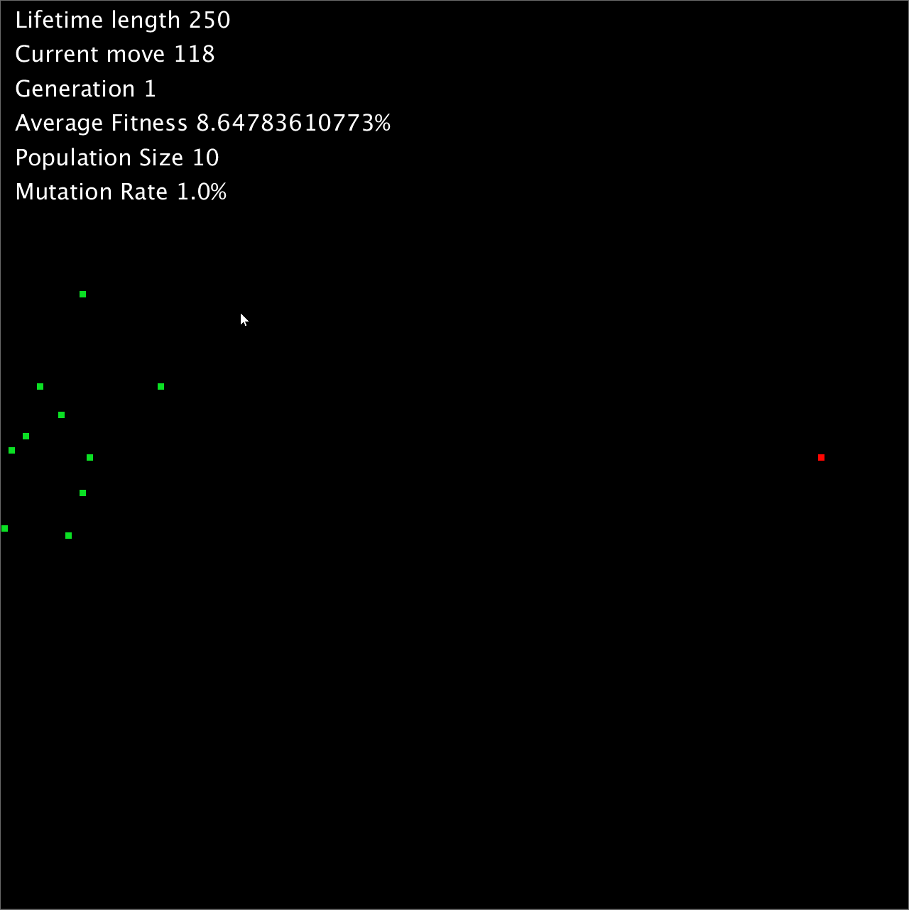

# Genetic-Pathfinding-Processing
Uses a genetic algorithm to find the most optimal path between two points

Designed and coded by Kyle Thorpe, 2018

**TODO**
- Change crossover function to handle obstacles better
- Optimize fitness function
- Change vehicles into circles which 'fly' around according to a vector (use flowfields to implement this)

**Usage**
1. Download the Python Processing. http://py.processing.org/tutorials/gettingstarted/
2. When Processing is running and in Python mode, open ML.pyde
3. Click run
4. Use the mouse to make obstacles. Click and hold will start the obstacle box, release the mouse to complete it

