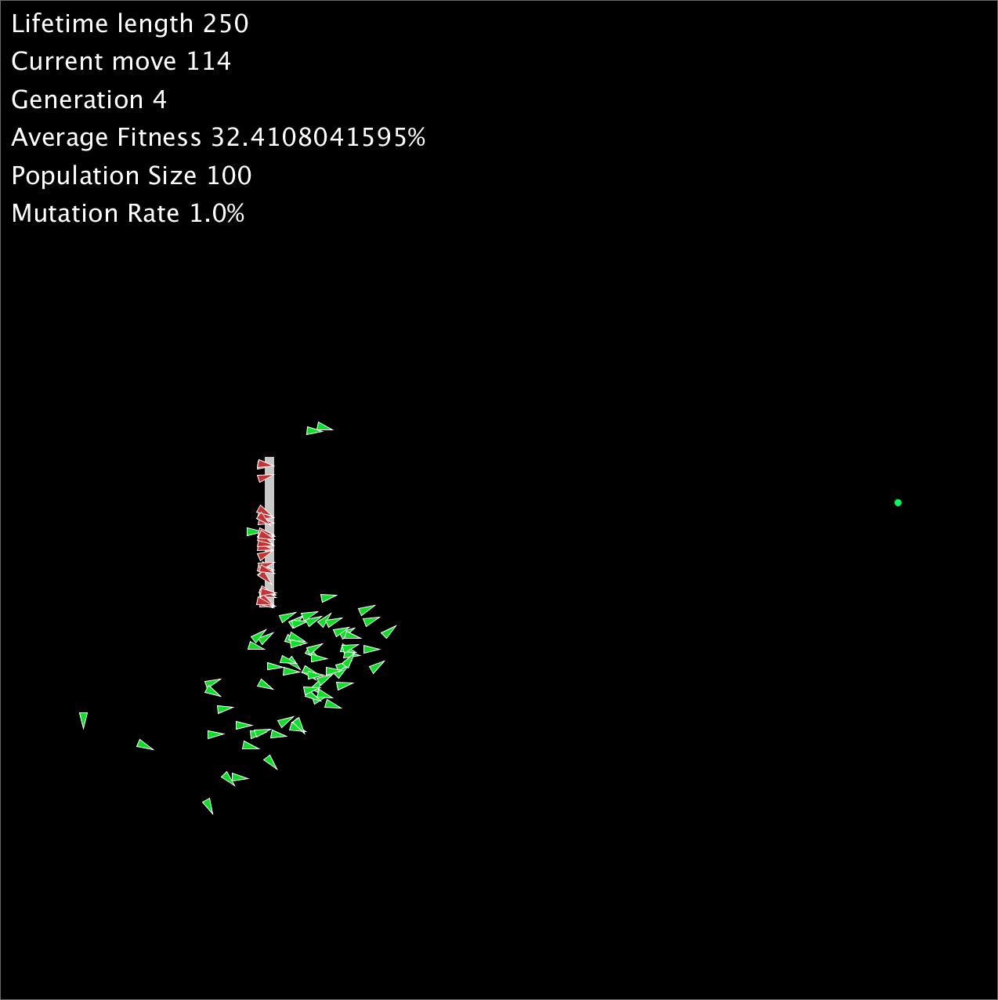

# Genetic-Pathfinding-Processing
Uses a genetic algorithm to find the most optimal path between two points

Designed and coded by Kyle Thorpe, 2018

**TODO**
- Change crossover function to handle obstacles better
- Optimize fitness function

**Usage**
1. Download the Python version of Processing. http://py.processing.org/tutorials/gettingstarted/
2. When Processing is running and in Python mode, open ML.pyde
3. Change the settings in ML.pyde. Depending on your system, a population size between 100 and 1000 is good. A Mutation Rate of 0.01 is recommended
4. Click run
5. Use the mouse to make obstacles. Click and hold will start the obstacle box, release the mouse to complete it

